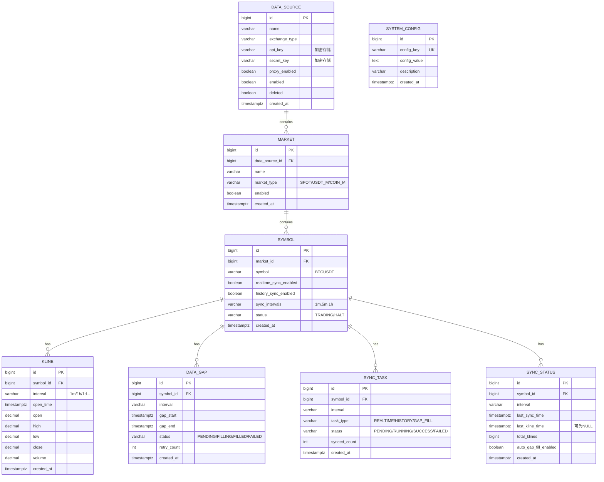

# 缠论交易分析平台 - 技术设计文档

## 技术栈

- **后端**: Java 21 / Spring Boot 3.x / MyBatis-Plus
- **前端**: Vue 3 + TypeScript + Tailwind CSS + ECharts
- **数据库**: PostgreSQL 15+
- **缓存**: Redis (可选，后续扩展)
- **构建工具**: Maven / Vite

---

## 系统架构

```
┌─────────────────────────────────────────────────────────────┐
│                      前端 (Vue 3)                            │
│  ┌─────────┐ ┌─────────┐ ┌─────────┐ ┌─────────┐           │
│  │数据源管理│ │市场管理 │ │交易对管理│ │数据同步 │           │
│  └─────────┘ └─────────┘ └─────────┘ └─────────┘           │
└─────────────────────────────────────────────────────────────┘
                              │
                              ▼
┌─────────────────────────────────────────────────────────────┐
│                   后端 (Spring Boot)                         │
│  ┌──────────────────────────────────────────────────────┐  │
│  │                    REST API Layer                     │  │
│  └──────────────────────────────────────────────────────┘  │
│  ┌──────────────────────────────────────────────────────┐  │
│  │                   Service Layer                       │  │
│  │  ┌────────────┐ ┌────────────┐ ┌────────────┐        │  │
│  │  │DataSource  │ │  Market    │ │  Symbol    │        │  │
│  │  │Service     │ │  Service   │ │  Service   │        │  │
│  │  └────────────┘ └────────────┘ └────────────┘        │  │
│  │  ┌────────────┐ ┌────────────┐                       │  │
│  │  │  Kline     │ │  DataGap   │                       │  │
│  │  │  Service   │ │  Service   │                       │  │
│  │  └────────────┘ └────────────┘                       │  │
│  └──────────────────────────────────────────────────────┘  │
│  ┌──────────────────────────────────────────────────────┐  │
│  │               Exchange Client Layer                   │  │
│  │  ┌────────────────────────────────────────────────┐  │  │
│  │  │         Binance Client (REST + WebSocket)       │  │  │
│  │  └────────────────────────────────────────────────┘  │  │
│  └──────────────────────────────────────────────────────┘  │
└─────────────────────────────────────────────────────────────┘
                              │
                              ▼
┌─────────────────────────────────────────────────────────────┐
│                     PostgreSQL                               │
└─────────────────────────────────────────────────────────────┘
```

---

## 数据库设计

### 1. 数据源表 (data_source)

| 字段 | 类型 | 说明 |
|------|------|------|
| id | BIGSERIAL | 主键 |
| name | VARCHAR(50) | 数据源名称 |
| exchange_type | VARCHAR(20) | 交易所类型 (BINANCE, OKX等) |
| api_key | VARCHAR(255) | API Key (加密存储) |
| secret_key | VARCHAR(500) | Secret Key (加密存储) |
| base_url | VARCHAR(255) | API基础URL |
| ws_url | VARCHAR(255) | WebSocket URL |
| proxy_enabled | BOOLEAN | 是否启用代理 |
| proxy_type | VARCHAR(10) | 代理类型 (HTTP/SOCKS5) |
| proxy_host | VARCHAR(100) | 代理地址 |
| proxy_port | INTEGER | 代理端口 |
| proxy_username | VARCHAR(100) | 代理用户名 |
| proxy_password | VARCHAR(255) | 代理密码 (加密存储) |
| enabled | BOOLEAN | 是否启用 |
| deleted | BOOLEAN | 软删除标记 (默认 false) |
| deleted_at | TIMESTAMPTZ | 删除时间 |
| created_at | TIMESTAMPTZ | 创建时间 (UTC) |
| updated_at | TIMESTAMPTZ | 更新时间 (UTC) |

### 2. 市场表 (market)

| 字段 | 类型 | 说明 |
|------|------|------|
| id | BIGSERIAL | 主键 |
| data_source_id | BIGINT | 数据源ID (外键) |
| name | VARCHAR(50) | 市场名称 |
| market_type | VARCHAR(20) | 市场类型 (SPOT/USDT_M/COIN_M) |
| enabled | BOOLEAN | 是否启用 |
| created_at | TIMESTAMPTZ | 创建时间 (UTC) |
| updated_at | TIMESTAMPTZ | 更新时间 (UTC) |

### 3. 交易对表 (symbol)

| 字段 | 类型 | 说明 |
|------|------|------|
| id | BIGSERIAL | 主键 |
| market_id | BIGINT | 市场ID (外键) |
| symbol | VARCHAR(30) | 交易对代码 (如 BTCUSDT) |
| base_asset | VARCHAR(20) | 基础货币 |
| quote_asset | VARCHAR(20) | 报价货币 |
| price_precision | INTEGER | 价格精度 |
| quantity_precision | INTEGER | 数量精度 |
| realtime_sync_enabled | BOOLEAN | 实时同步开关 |
| history_sync_enabled | BOOLEAN | 历史同步开关 |
| sync_intervals | VARCHAR(100) | 同步周期 (逗号分隔: 1m,5m,1h) |
| status | VARCHAR(20) | 交易对状态 (TRADING/HALT) |
| created_at | TIMESTAMPTZ | 创建时间 (UTC) |
| updated_at | TIMESTAMPTZ | 更新时间 (UTC) |

**索引**: (market_id, symbol) UNIQUE

### 4. K线数据表 (kline)

| 字段 | 类型 | 说明 |
|------|------|------|
| id | BIGSERIAL | 主键 |
| symbol_id | BIGINT | 交易对ID (外键) |
| interval | VARCHAR(10) | 时间周期 (1m/3m/5m/15m/30m/1h/2h/4h/6h/8h/12h/1d/3d/1w/1M) |
| open_time | TIMESTAMPTZ | 开盘时间 (UTC) |
| open | DECIMAL(24,8) | 开盘价 |
| high | DECIMAL(24,8) | 最高价 |
| low | DECIMAL(24,8) | 最低价 |
| close | DECIMAL(24,8) | 收盘价 |
| volume | DECIMAL(24,8) | 成交量 |
| quote_volume | DECIMAL(24,8) | 成交额 |
| trades | INTEGER | 成交笔数 |
| close_time | TIMESTAMPTZ | 收盘时间 (UTC) |
| created_at | TIMESTAMPTZ | 创建时间 (UTC) |

**索引**: (symbol_id, interval, open_time) UNIQUE
**分区**: 按 open_time 按月分区 (可选优化)

### 5. 数据缺口表 (data_gap)

| 字段 | 类型 | 说明 |
|------|------|------|
| id | BIGSERIAL | 主键 |
| symbol_id | BIGINT | 交易对ID (外键) |
| interval | VARCHAR(10) | 时间周期 |
| gap_start | TIMESTAMPTZ | 缺口开始时间 (UTC) |
| gap_end | TIMESTAMPTZ | 缺口结束时间 (UTC) |
| missing_count | INTEGER | 缺失K线数量 |
| status | VARCHAR(20) | 状态 (PENDING/FILLING/FILLED/FAILED) |
| retry_count | INTEGER | 重试次数 |
| error_message | TEXT | 错误信息 |
| created_at | TIMESTAMPTZ | 创建时间 (UTC) |
| updated_at | TIMESTAMPTZ | 更新时间 (UTC) |

**索引**: (symbol_id, interval, status)

### 6. 同步任务表 (sync_task)

| 字段 | 类型 | 说明 |
|------|------|------|
| id | BIGSERIAL | 主键 |
| symbol_id | BIGINT | 交易对ID (外键) |
| interval | VARCHAR(10) | 时间周期 |
| task_type | VARCHAR(20) | 任务类型 (REALTIME/HISTORY/GAP_FILL) |
| status | VARCHAR(20) | 状态 (PENDING/RUNNING/SUCCESS/FAILED) |
| start_time | TIMESTAMPTZ | 同步起始时间 (UTC) |
| end_time | TIMESTAMPTZ | 同步结束时间 (UTC) |
| synced_count | INTEGER | 已同步数量 |
| retry_count | INTEGER | 重试次数 |
| max_retries | INTEGER | 最大重试次数 (默认3) |
| error_message | TEXT | 错误信息 |
| created_at | TIMESTAMPTZ | 创建时间 (UTC) |
| updated_at | TIMESTAMPTZ | 更新时间 (UTC) |

**说明**:
- 同步任务用于记录实时/历史/缺口回补执行记录
- 缺口回补（手动/自动）必须创建 sync_task，task_type=GAP_FILL

### 7. 同步状态表 (sync_status)

| 字段 | 类型 | 说明 |
|------|------|------|
| id | BIGSERIAL | 主键 |
| symbol_id | BIGINT | 交易对ID (外键) |
| interval | VARCHAR(10) | 时间周期 |
| last_sync_time | TIMESTAMPTZ | 最后同步时间 (UTC) |
| last_kline_time | TIMESTAMPTZ | 最后一根K线的开盘时间 (UTC)，无数据时为 NULL |
| total_klines | BIGINT | 总K线数量 |
| auto_gap_fill_enabled | BOOLEAN | 该周期自动回补开关 (默认 true) |
| created_at | TIMESTAMPTZ | 创建时间 (UTC) |
| updated_at | TIMESTAMPTZ | 更新时间 (UTC) |

**索引**: (symbol_id, interval) UNIQUE

**说明**:
- `last_kline_time` 为 NULL 表示该周期无K线数据
- 历史/实时/缺口回补成功后更新 `last_sync_time`
- `last_kline_time` 更新为当前值与本次写入最大 `open_time` 取 max
- `total_klines` 按新增写入数量增量更新（删除后由删除逻辑重算）
- 手动删除历史数据后需重算 `last_kline_time` 与 `total_klines`
- `auto_gap_fill_enabled` 用于控制该交易对该周期是否参与自动缺口回补
- 手动删除历史数据后，系统自动将 `auto_gap_fill_enabled` 设为 false，需用户手动开启

### 8. 系统配置表 (system_config)

| 字段 | 类型 | 说明 |
|------|------|------|
| id | BIGSERIAL | 主键 |
| config_key | VARCHAR(100) | 配置键 |
| config_value | TEXT | 配置值 |
| description | VARCHAR(255) | 配置说明 |
| created_at | TIMESTAMPTZ | 创建时间 (UTC) |
| updated_at | TIMESTAMPTZ | 更新时间 (UTC) |

**索引**: (config_key) UNIQUE

### 实体关系图 (ER Diagram)



### 状态机图 (State Diagrams)

#### 数据缺口状态流转


#### 同步任务状态流转


#### 数据源/市场/交易对启用状态级联


#### 历史数据同步流程


**预置配置项**:

- `sync.symbol.cron` - 交易对同步Cron表达式 (默认: `0 0 2 * * ?` 每天凌晨2点)
- `sync.realtime.enabled` - 实时同步总开关 (默认: true)
- `sync.history.cron` - 历史数据增量同步Cron表达式 (默认: `0 30 3 * * ?` 每天凌晨3:30)
- `sync.history.auto` - 历史数据自动增量同步开关 (默认: true)
- `sync.gap_detect.cron` - 缺口检测Cron表达式 (默认: `0 0 * * * ?` 每小时)
- `sync.gap_fill.auto` - 自动回补开关 (默认: false)
- `sync.gap_fill.max_retry` - 回补最大重试次数 (默认: 3)
- `sync.gap_fill.batch_size` - 单次回补批量大小 (默认: 10)
- `sync.gap_fill.interval_ms` - 回补任务间隔毫秒数 (默认: 1000，防止限流)

---

## API 设计

### 通用说明

**认证方式**: 本系统为个人使用，暂不实现用户认证。敏感操作（删除、禁用）通过前端二次确认实现。

**响应格式**:
```json
{
  "code": 200,
  "message": "success",
  "data": {}
}
```

**分页参数**: `page` (页码，从1开始), `size` (每页数量，默认20，最大100)

### 1. 数据源管理 API

| 方法 | 路径 | 说明 |
|------|------|------|
| GET | /api/v1/datasources | 获取数据源列表 |
| GET | /api/v1/datasources/{id} | 获取数据源详情 |
| POST | /api/v1/datasources | 创建数据源 |
| PUT | /api/v1/datasources/{id} | 更新数据源 |
| DELETE | /api/v1/datasources/{id} | 删除数据源 (软删除，需确认) |
| POST | /api/v1/datasources/{id}/test | 测试数据源连接 |
| POST | /api/v1/datasources/{id}/test-proxy | 测试代理连接 |
| PATCH | /api/v1/datasources/{id}/status | 启用/禁用数据源 |

**PATCH /api/v1/datasources/{id}/status 请求体**:
```json
{ "enabled": true }
```

### 2. 市场管理 API

| 方法 | 路径 | 说明 |
|------|------|------|
| GET | /api/v1/markets | 获取市场列表 (支持 ?dataSourceId= 筛选) |
| GET | /api/v1/markets/{id} | 获取市场详情 |
| PATCH | /api/v1/markets/{id}/status | 启用/禁用市场 |
| POST | /api/v1/datasources/{id}/sync-markets | 同步市场信息 |

**PATCH /api/v1/markets/{id}/status 请求体**:
```json
{ "enabled": true }
```

### 3. 交易对管理 API

| 方法 | 路径 | 说明 |
|------|------|------|
| GET | /api/v1/symbols | 获取交易对列表 |
| GET | /api/v1/symbols/{id} | 获取交易对详情 |
| PATCH | /api/v1/symbols/{id}/realtime-sync | 开启/关闭实时同步 |
| PATCH | /api/v1/symbols/{id}/history-sync | 开启/关闭历史同步 |
| PUT | /api/v1/symbols/{id}/intervals | 配置同步周期 |
| POST | /api/v1/markets/{id}/sync-symbols | 同步交易对列表 |

**GET /api/v1/symbols 查询参数**:
- `marketId` - 市场ID
- `dataSourceId` - 数据源ID
- `keyword` - 搜索关键词
- `realtimeSyncEnabled` - 实时同步状态 (true/false)
- `historySyncEnabled` - 历史同步状态 (true/false)

**PATCH /api/v1/symbols/{id}/realtime-sync 请求体**:
```json
{ "enabled": true }
```

**PUT /api/v1/symbols/{id}/intervals 请求体**:
```json
{ "intervals": ["1m", "5m", "1h", "4h", "1d"] }
```

### 4. 数据同步 API

| 方法 | 路径 | 说明 |
|------|------|------|
| GET | /api/v1/sync/tasks | 获取同步任务列表 |
| POST | /api/v1/sync/symbols/{id}/history | 触发历史同步 |

**GET /api/v1/sync/tasks 查询参数**:
- `symbolId` - 交易对ID
- `taskType` - 任务类型 (REALTIME/HISTORY/GAP_FILL)
- `status` - 状态 (PENDING/RUNNING/SUCCESS/FAILED)

**POST /api/v1/sync/symbols/{id}/history 请求体**:
```json
{
  "interval": "1h",
  "startTime": "2025-01-01T00:00:00Z",
  "endTime": "2025-01-15T00:00:00Z"
}
```

**说明**: `startTime` 与 `endTime` 为必填，且 `startTime` < `endTime`

### 5. K线数据 API

| 方法 | 路径 | 说明 |
|------|------|------|
| GET | /api/v1/klines | 获取K线数据 |

**GET /api/v1/klines 查询参数**:
- `symbolId` (必填) - 交易对ID
- `interval` (必填) - 时间周期 (1m/3m/5m/15m/30m/1h/2h/4h/6h/8h/12h/1d/3d/1w/1M)
- `startTime` - 开始时间 (ISO 8601格式)
- `endTime` - 结束时间 (ISO 8601格式)
- `limit` - 返回数量 (默认500，最大1000)

**性能优化**: 
- 使用数据库索引 (symbol_id, interval, open_time)
- 单次查询限制1000条
- 大时间范围查询建议分页

### 6. 数据缺口 API

| 方法 | 路径 | 说明 |
|------|------|------|
| GET | /api/v1/gaps | 获取缺口列表 |
| POST | /api/v1/gaps/detect | 检测数据缺口 |
| POST | /api/v1/gaps/{id}/fill | 回补单个缺口 |
| POST | /api/v1/gaps/batch-fill | 批量回补缺口 |

**GET /api/v1/gaps 查询参数**:
- `symbolId` - 交易对ID
- `interval` - 时间周期
- `status` - 状态 (PENDING/FILLING/FILLED/FAILED)

**POST /api/v1/gaps/detect 请求体**:
```json
{
  "symbolId": 1,
  "interval": "1h"
}
```
或批量检测:
```json
{
  "detectAll": true
}
```

### 7. 同步状态 API

| 方法 | 路径 | 说明 |
|------|------|------|
| GET | /api/v1/sync/status | 获取同步状态列表 |
| PATCH | /api/v1/sync/status/{id}/auto-gap-fill | 开启/关闭该周期自动回补 |

**PATCH /api/v1/sync/status/{id}/auto-gap-fill 请求体**:
```json
{ "enabled": true }
```

### 8. 系统配置 API

| 方法 | 路径 | 说明 |
|------|------|------|
| GET | /api/v1/config | 获取所有配置 |
| GET | /api/v1/config/{key} | 获取单个配置 |
| PUT | /api/v1/config/{key} | 更新配置 |

**PUT /api/v1/config/{key} 请求体**:
```json
{ "value": "0 0 3 * * ?" }
```

---

## 后端项目结构

```
chanlun-backend/
├── src/main/java/com/chanlun/
│   ├── ChanlunApplication.java
│   ├── config/
│   │   ├── SecurityConfig.java
│   │   ├── MyBatisPlusConfig.java
│   │   └── SchedulerConfig.java
│   ├── controller/
│   │   ├── DataSourceController.java
│   │   ├── MarketController.java
│   │   ├── SymbolController.java
│   │   ├── SyncController.java
│   │   └── GapController.java
│   ├── service/
│   │   ├── DataSourceService.java
│   │   ├── MarketService.java
│   │   ├── SymbolService.java
│   │   ├── KlineService.java
│   │   ├── SyncService.java
│   │   └── GapService.java
│   ├── mapper/
│   │   ├── DataSourceMapper.java
│   │   ├── MarketMapper.java
│   │   ├── SymbolMapper.java
│   │   ├── KlineMapper.java
│   │   └── DataGapMapper.java
│   ├── entity/
│   │   ├── DataSource.java
│   │   ├── Market.java
│   │   ├── Symbol.java
│   │   ├── Kline.java
│   │   └── DataGap.java
│   ├── dto/
│   ├── exchange/
│   │   ├── ExchangeClient.java
│   │   ├── binance/
│   │   │   ├── BinanceClient.java
│   │   │   ├── BinanceSpotClient.java
│   │   │   └── BinanceFuturesClient.java
│   │   └── model/
│   ├── scheduler/
│   │   ├── SyncScheduler.java
│   │   └── GapDetectScheduler.java
│   └── util/
│       ├── EncryptUtil.java
│       └── ProxyUtil.java
├── src/main/resources/
│   ├── application.yml
│   ├── mapper/
│   └── db/migration/
└── pom.xml
```

---

## 前端项目结构

```
chanlun-frontend/
├── src/
│   ├── main.ts
│   ├── App.vue
│   ├── api/
│   │   ├── datasource.ts
│   │   ├── market.ts
│   │   ├── symbol.ts
│   │   ├── sync.ts
│   │   └── gap.ts
│   ├── views/
│   │   ├── datasource/
│   │   │   ├── DataSourceList.vue
│   │   │   └── DataSourceForm.vue
│   │   ├── market/
│   │   │   └── MarketList.vue
│   │   ├── symbol/
│   │   │   └── SymbolList.vue
│   │   ├── sync/
│   │   │   └── SyncTaskList.vue
│   │   └── gap/
│   │       └── GapList.vue
│   ├── components/
│   ├── stores/
│   ├── router/
│   └── utils/
├── index.html
├── vite.config.ts
├── tailwind.config.js
└── package.json
```

---

## 正确性属性 (Correctness Properties)

### P1: 数据源密钥加密存储
- API Key 和 Secret Key 必须使用 AES-256 加密后存储
- 数据库中不得存储明文密钥

### P2: 交易对同步开关默认关闭
- 新同步的交易对 realtime_sync_enabled 和 history_sync_enabled 必须为 false
- 只有用户手动开启后才能同步数据

### P3: K线数据唯一性
- 同一交易对、同一周期、同一开盘时间的K线数据只能有一条
- 重复数据应更新而非插入

### P4: 数据缺口状态流转
- 缺口状态只能按 PENDING → FILLING → FILLED/FAILED 流转
- FILLED 状态的缺口不能再次回补

### P5: 代理配置隔离
- 每个数据源的代理配置独立
- 代理配置变更不影响其他数据源

---

## 关键实现细节

### 1. 密钥加密
使用 AES-256-GCM 加密，密钥从环境变量读取：
```java
@Value("${app.encryption.key}")
private String encryptionKey;
```

### 2. 代理支持
使用 OkHttp 的 Proxy 配置：
```java
Proxy proxy = new Proxy(Proxy.Type.HTTP, 
    new InetSocketAddress(proxyHost, proxyPort));
OkHttpClient client = new OkHttpClient.Builder()
    .proxy(proxy)
    .proxyAuthenticator(authenticator)
    .build();
```

### 3. 币安API集成

#### API端点
| 市场类型 | REST API | WebSocket |
|---------|----------|-----------|
| 现货 (SPOT) | https://api.binance.com | wss://stream.binance.com:9443/ws |
| U本位合约 (USDT_M) | https://fapi.binance.com | wss://fstream.binance.com/ws |
| 币本位合约 (COIN_M) | https://dapi.binance.com | wss://dstream.binance.com/ws |

#### 核心接口
- `GET /api/v3/exchangeInfo` - 获取交易对信息 (weight: 20)
- `GET /api/v3/klines` - 获取历史K线 (weight: 2, limit最大1000)
- `wss://.../ws/<symbol>@kline_<interval>` - 实时K线推送

#### K线周期支持
系统启用周期：`1m, 3m, 5m, 15m, 30m, 1h, 2h, 4h, 6h, 8h, 12h, 1d, 3d, 1w, 1M`（不启用 1s）

#### 限流规则
- REST API: 6000 weight/分钟 (REQUEST_WEIGHT)
- WebSocket: 5条消息/秒，300连接/5分钟
- K线接口 weight=2，理论上可 3000次/分钟

#### K线数据结构
```json
[
  1499040000000,      // 开盘时间 (毫秒)
  "0.01634790",       // 开盘价
  "0.80000000",       // 最高价
  "0.01575800",       // 最低价
  "0.01577100",       // 收盘价
  "148976.11427815",  // 成交量
  1499644799999,      // 收盘时间
  "2434.19055334",    // 成交额
  308,                // 成交笔数
  "1756.87402397",    // 主动买入成交量
  "28.46694368",      // 主动买入成交额
  "0"                 // 忽略
]
```

#### WebSocket K线推送结构
```json
{
  "e": "kline",
  "E": 1672515782136,
  "s": "BTCUSDT",
  "k": {
    "t": 1672515780000,   // K线开始时间
    "T": 1672515839999,   // K线结束时间
    "i": "1m",            // 周期
    "o": "0.0010",        // 开盘价
    "c": "0.0020",        // 收盘价
    "h": "0.0025",        // 最高价
    "l": "0.0015",        // 最低价
    "v": "1000",          // 成交量
    "n": 100,             // 成交笔数
    "x": false,           // K线是否完结
    "q": "1.0000"         // 成交额
  }
}
```

### 4. 定时任务

使用 Spring Scheduler，频率从 system_config 表读取，支持动态配置：

| 任务 | 配置键 | 默认值 | 说明 |
|------|--------|--------|------|
| 交易对列表同步 | sync.symbol.cron | 0 0 2 * * ? | 每天凌晨2点 |
| 历史数据增量同步 | sync.history.cron | 0 30 3 * * ? | 每天凌晨3:30，补充昨日数据 |
| 历史数据自动同步开关 | sync.history.auto | true | 是否启用定时增量同步 |
| 缺口检测 | sync.gap_detect.cron | 0 0 * * * ? | 每小时整点 |
| 自动缺口回补 | sync.gap_fill.auto | false | 检测到缺口后自动回补 |
| 回补批量大小 | sync.gap_fill.batch_size | 10 | 单次处理缺口数量 |
| 回补任务间隔 | sync.gap_fill.interval_ms | 1000 | 任务间隔(ms)，防止API限流 |

**Cron 时区**: 所有定时任务按 UTC 执行，SchedulerConfig 统一设置时区为 UTC。

**实时K线同步**: 通过 WebSocket 推送，不依赖定时任务。WebSocket 断连时自动重连并通过 REST API 补充缺失数据。`sync.realtime.enabled=false` 时立即断开已有 WebSocket 订阅并停止新订阅。

**历史数据同步**: 支持两种方式：
1. 手动触发：用户指定时间范围拉取
2. 定时增量：每天自动补充前一天的数据（需开启 sync.history.auto）

**定时增量追赶策略**:
- 以 `sync_status.last_kline_time` 为起点，从下一根 K 线时间开始拉取
- 若无记录（首次启用），仅补前一天，避免自动全量拉取
- 若停机导致跨度 > 30 天，则按“单次时间跨度 ≤ 30 天”分段追赶，直到补齐到前一天
- 每次补齐后更新 `sync_status`

**自动任务筛选规则**:
- 仅处理未删除且启用的数据源、启用市场下的交易对
- 实时同步：`sync.realtime.enabled=true` 且 `realtime_sync_enabled=true`，并且 `sync_intervals` 包含对应周期
- 历史同步：`history_sync_enabled=true`，并且 `sync_intervals` 包含对应周期
- 缺口检测/回补：仅针对 `history_sync_enabled=true` 且 `sync_intervals` 包含对应周期的交易对

**自动缺口回补限流策略**:
- 每次最多处理 batch_size 个缺口
- 每个缺口回补后等待 interval_ms 毫秒
- 单个缺口失败后记录错误，继续处理下一个
- 达到 max_retry 次后标记为 FAILED，不再自动重试

---

## 数据一致性策略

### 删除/禁用规则

| 操作 | 策略 | 说明 |
|------|------|------|
| 删除数据源 | 软删除 + 级联禁用 | 设置 deleted=true，级联禁用所有市场和交易对的同步（实时+历史） |
| 禁用数据源 | 级联禁用 | 停止该数据源下所有交易对的实时同步和历史同步 |
| 禁用市场 | 级联禁用 | 停止该市场下所有交易对的实时同步和历史同步 |
| 删除交易对 | 禁止 | 交易对不支持删除，只能禁用同步 |

### 历史数据保留

- 禁用/删除数据源后，已同步的K线数据默认永久保留
- 不自动清理历史数据，确保至少1年分钟级数据可用
- 允许手动删除指定范围历史数据（后续可实现管理界面）

---

## 性能设计

### 容量估算

以 BTCUSDT 1分钟K线为例：
- 1年数据量：365 × 24 × 60 = 525,600 条
- 单条记录约 200 字节
- 单交易对单周期 1年约 100MB

假设监控 50 个交易对 × 5 个周期 = 250 个数据流
- 1年总数据量约 25GB（可接受）

### 查询性能保障

| 策略 | 说明 |
|------|------|
| 复合索引 | (symbol_id, interval, open_time) 覆盖主要查询场景 |
| 查询限制 | 单次最多返回 1000 条，强制分页 |
| 时间范围限制 | 单次查询时间跨度建议不超过 30 天 |
| 表分区（可选） | 按月分区，提升大表查询性能 |

### 500ms 响应时间保障

- 索引覆盖：确保查询走索引
- 连接池：HikariCP 默认配置
- 本地部署：无网络延迟
- 如仍不达标：考虑 Redis 缓存热点数据

---

## 时区规范

| 层级 | 时区 | 说明 |
|------|------|------|
| 数据库 | UTC | 所有 TIMESTAMPTZ 字段存储 UTC 时间 |
| API 传输 | UTC | ISO 8601 格式，带 Z 后缀 (如 2025-01-01T00:00:00Z) |
| 前端展示 | 本地时区 | 前端负责转换为用户本地时区显示 |
| 币安API | UTC | 币安返回的时间戳为 UTC 毫秒 |

**K线时间对齐规则**：
- 1m K线：open_time 为整分钟 (秒=0)
- 1h K线：open_time 为整小时 (分=0, 秒=0)
- 1d K线：open_time 为 UTC 00:00:00
